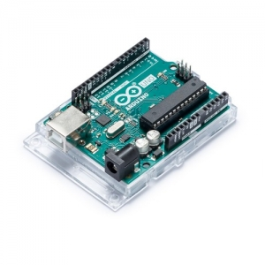
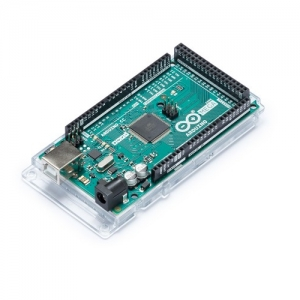

# Arduino_기초 교육
## 목차
1. Arduino란?
2. Arduino 종류 
3. Arduino 각각의 요놈의 성능
4.
5.
* * *
###1. Arduino란?   

   아두이노(Arduino)는 오픈소스를 기반으로 한 단일 보드 마이크로컨트롤러이다. 아트멜AVR을  
기반으로 한 보드로 이루어져 있고 최근에는 Cortex-M3를 이용한 제품(Arduino Due)도 있다.   
소프트웨어 개발을 위한 통합 환경(IDE)이 있다. 아두이노는 다수의 스위치나 센서로부터 값을 받아들여, LED나 모터와   
같은 외부 전자 장치들을 통제함으로써 환경과 상호작용이 가능한 물건을 만들어 낼 수 있다.   
       
   
   
  ###_어려운 설명말고 다시 쉽게!!!_   
   아두이노는 자신이 원하는 프로젝트를 만들기 위한 작은 컴퓨터이다! Game을 python으로 만들려면 pygame을 다운   
해야하고 data 분석을 위해서는 anaconda가 필수이다. 그렇다면 여러분이 만들고 싶은 프로젝트를 만들기 위해서는   
이것도 필요하고 저것도 필요하고 프로젝트는 프로젝트대로 머리만 지끈 지끈아픈디....   
   
      
         
.   

.   
.      
.
      
    
    
 ### _아두이노는 이런 여러분을 구제 하여 줄 것입니다._
 ***
 ### 2. Arudino 종류
 프로젝트를 진행하기 위해 Arduino를 살려고하는데 오미...   
 뭐가 이리 많어..... 사야 될 꺼 딱정해 드립니다.   
    .   
    
아두이노 UNO 보드 : 아두이노의 표준 보드로 온라인 상에 있는 대부분의 예제와 강좌, 소스 라이브러리가 UNO보드에 맞춰져 
있기 때문에 초보자라면 당연히 UNO 보드를 선택하시면 됩니다. 현재 R3 번전까지 나와있습니다.
   
아두이노 Mega 보드   