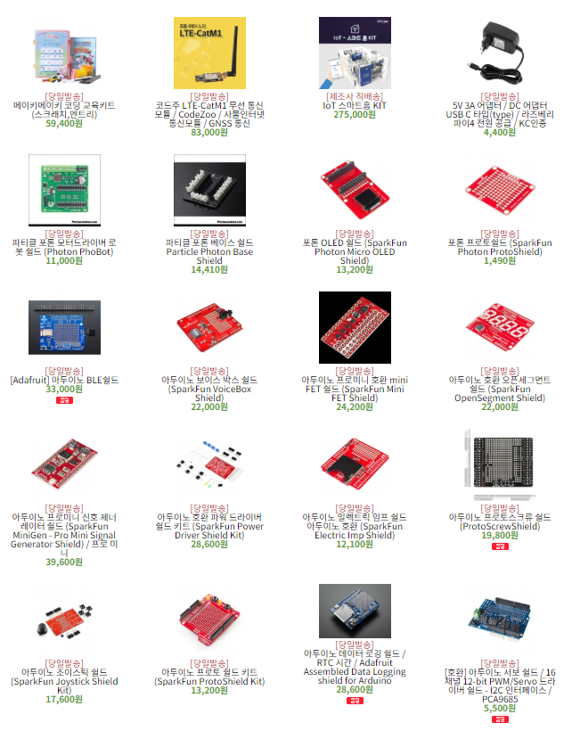
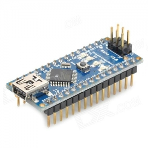
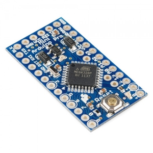

# Arduino_기초 교육
## 목차
1. Arduino란?
2. Arduino 종류 
3. Arduino 각각의 요놈의 성능
4. Arduino 동작시키키 위한 과정
5.
* * *
### 1. Arduino란?   

   아두이노(Arduino)는 오픈소스를 기반으로 한 단일 보드 마이크로컨트롤러이다. 아트멜AVR을  
기반으로 한 보드로 이루어져 있고 최근에는 Cortex-M3를 이용한 제품(Arduino Due)도 있다.   
소프트웨어 개발을 위한 통합 환경(IDE)이 있다. 아두이노는 다수의 스위치나 센서로부터 값을 받아들여, LED나 모터와   
같은 외부 전자 장치들을 통제함으로써 환경과 상호작용이 가능한 물건을 만들어 낼 수 있다.   
       
   
   
  ### _어려운 설명말고 다시 쉽게!!!_   
   아두이노는 자신이 원하는 프로젝트를 만들기 위한 작은 컴퓨터이다! Game을 python으로 만들려면 pygame을 다운   
해야하고 data 분석을 위해서는 anaconda가 필수이다. 그렇다면 여러분이 만들고 싶은 프로젝트를 만들기 위해서는   
이것도 필요하고 저것도 필요하고 프로젝트는 프로젝트대로 머리만 지끈 지끈아픈디....   
   
      
         
.   

.   
.      
.
      
    
    
 ### _아두이노는 이런 여러분을 구제 하여 줄 것입니다._
 ***
 ### 2. Arudino 종류
 프로젝트를 진행하기 위해 Arduino를 살려고하는데 holy sh...!   
      
  　   
  
 뭐가 이리 많어.....   
  ### ***스피드 웨건*** : 사야 될 꺼 딱정해 드립니다.      
   　
    
 
_아두이노 UNO 보드_ : 아두이노의 표준 보드로 온라인 상에 있는 대부분의 예제와 강좌, 소스 라이브러리가 UNO보드에 맞춰져 
있기 때문에 초보자라면 당연히 UNO 보드를 선택하시면 됩니다. 현재 R3 번전까지 나와있습니다.   
##### => 가장 기본적이 아두이노로 밑에 꺼 안쓸거고 아몰랑 하시면 일단 이거 사시면 됩니당
   

_아두이노 Mega 보드_ : 아두이노 UNO보드의 약 2배 크기에 제어할 수 있는 핀도 훨씬 많고, 더 빠르고, 저장용량도  
더 많이 가진 보드입니다. 아두이노 UNO보드에서 처리하기 힘든 멀티미디어 관련 작업이나 복잡한 제어가 필요한  
작업에 알맞는 보드 입니다. RX TX 즉 수신단 송신단 두개가 필요한 센서들인 블루투스, 적외선 등등을 여러개  
 사용할 때 여러 개 사용하 실 때 Mega를 사용 하시면 됩니다. 하지만 Mega의 오픈 소스는 훨씬 작으므로 조심  
 원래 잘 작동하던 센서들도 안 되는 경우가 많습니다. 이렇게 되면 끝없는 혼돈의 소용돌이에 빠지게 되니  
 arduino를 좀 잘 다룰줄 안다! 이러시는 분들에게 추천 드립니다. 빠르긴 정말 빠릅니다.  
 ##### => 가장 빠르고!! 가장 저장 공간 많고!! 가장 성능 좋고!! 센서도 많고!! 겁나 어렵고!!(?)  
    
   
   _아두이노 Nano 보드_ : 아두이노 UNO 보드의 소형화 버전이라고 생각하시면 가장 편합니다. 아두이노 UNO를 거의  
   그대로 들고 왔다해도 무방할 정도로 UNO와 호환성이 좋고 크기가 굉장히 작습니다. 하지만 UNO보드는 각가의  
   핀에 female 소켓이 달려 있어서 일반적인 케이블로 활용 하여야 합니다. 이렇게 사용하려고 납땜하려다가 옆에  
   다른것을 건들이면.... 사진의 그림처럼 male 핀 헤더가 장착 되어 있는 보드를 사시는게 심신건강에 좋습니다.  
   　  
   ##### => 요즘 가장 핫한 보드 크기가 작아 여러 프로젝트에 사용 할 수 있다. 대신 UNO와 Mega와 다른 케이블이 필요하다. 그리고 회로도에 대한 지식이 없으면 정말 말도 안되는 곳에서 막힐 수가 있다.    
   
     
  　  
  아두이노 Pro/Pro mini : 아두이노 보드 중 가장 작은 사이즈로 손가락 두마디 정도에 아두이노의 기능이 탑재  
  되어 있다. 이때 3.3V/5V 용이 따로 존재하기 때문에 외부 센서나 모듈의 동작전압과 맞춰야 하고 USB에 바로 꽂아  
  소스를 업로드 할 수가 없어 또 다른 USB 모듈을 납땜해야 한다.  
  　  
  ##### => 작은고추가 매운법 Mini를 사용하려고 다른 곳에 힘을 다주다가 소스 업로드도 못하다가 끝날 수도 있다.
  그밖에도 정말 다양한 종류가 있다. 예를들어 Leonardo, Due, ESPLORA, Ehternet, BT(Bluetooth) 등등이 있지만  
  사실 Arduino Uno에 나중에 배울 Shield라는 아주 좋은 것을 통해 확장이 되므로 굳이 안배워도 될 것이다.  
  ***
  ### 3. Arudino 성능비교
  표[1] 여을 예정  
  
  하나 하나 의 특성은 위에서 다 설명 했고 혹시나 프로젝트를 진행하기전에 이부분에서 만족안 하는 부분이 있는지  
  알고 넘어가야 한다. 만약 프로젝트 중간에 막혀 버리면 어마어마한 시간이 소비 되기때문에 미리 사전 예방 차원  
  으로 확인하고 넘어가면 좋을 것이다. 이밖에도 여러 문제가 많이 생길 것인데 이때 datasheet라는 친구와 친해지면  
  온라인 교수님이 생기게 된다.  
  　  
    
  위 그림 처럼 검색하게 되면 여러 파일 들이 나올 껀데 datasheet는 원래 기존 판매처에서 확인 하는 것이 가장  
  신빙성이 있다. Arudino Uno의 DATASHEET를 뜯어 보는 것은 결국  [ATmega328P_Datasheet](http://ww1.microchip.com/downloads/en/DeviceDoc/Atmel-7810-Automotive-Microcontrollers-ATmega328P_Datasheet.pdf) 를 뜯어 보는 것인데 정말  
  하드웨어 프로젝트의 끝판왕으로서 군림하고 싶으면 한번쯤 뜯어 보면 Arduino가 그렇게 대단한 놈인지 알게 될  
  것이다.
  ***
  ### 4. Arduino 동작시키키 위한 과정